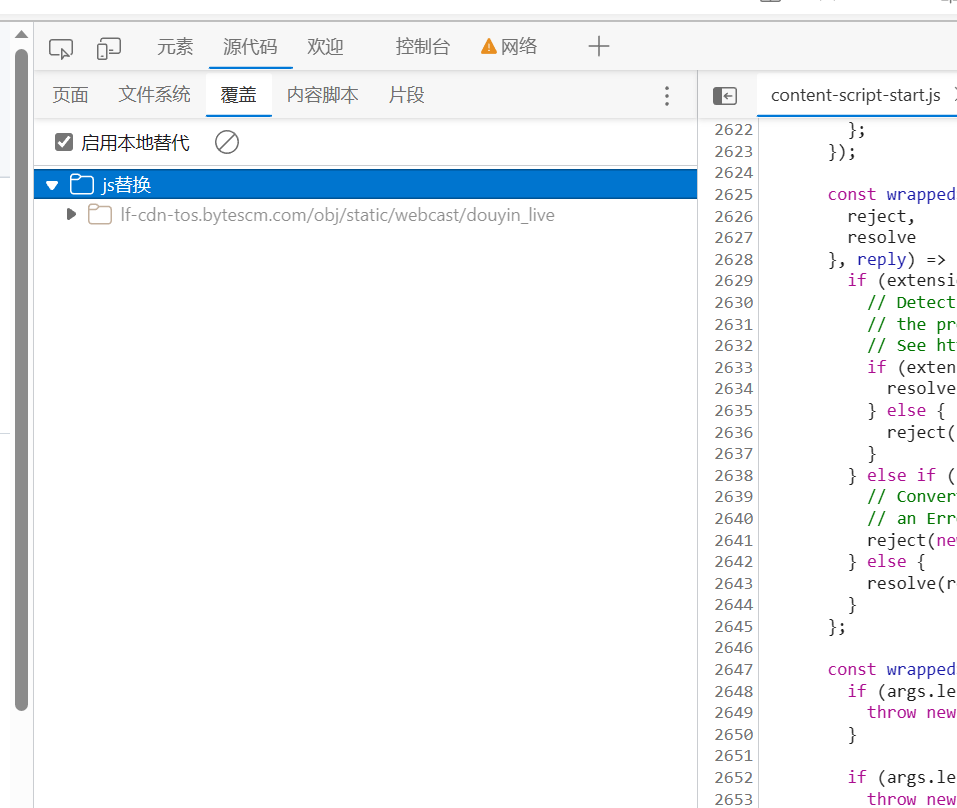
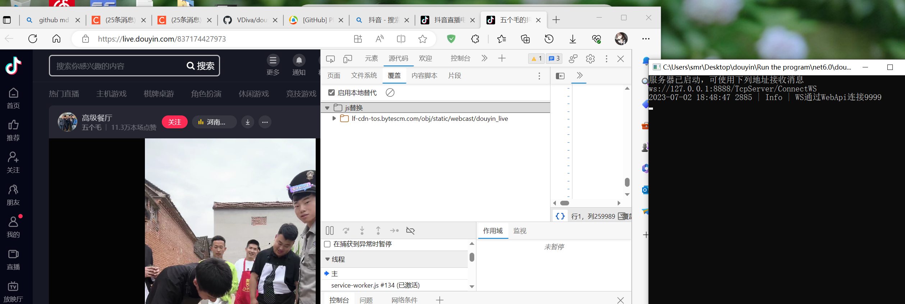
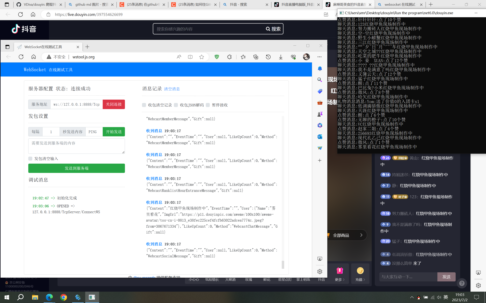

# douyin
爬取抖音直播间弹幕和礼物信息

目前只能微软edge浏览器使用 需要在edge浏览器开发者工具中添加本地代码覆盖选择Browser injection/js替换

在从Run the program/net打开douyin.exe在打开浏览器找你需要的直播间并打开开发者工具 看见有端口9999连接上了就是浏览器连接上了就可以使用了

如果好久都没有可能注入代码引起报错了 刷新浏览器试试不行就多刷新几遍

你可以用自己的websocket接收消息 ws://127.0.0.1:8888/TcpServer/ConnectWS

通过protobuf的proto文件生成你自己的代码进行反序列化

还有好多值我没有进protobuf如果需要你可以看浏览器的控制台打印的消息自己添加进protobuf里面在修改一下 c#项目代码

